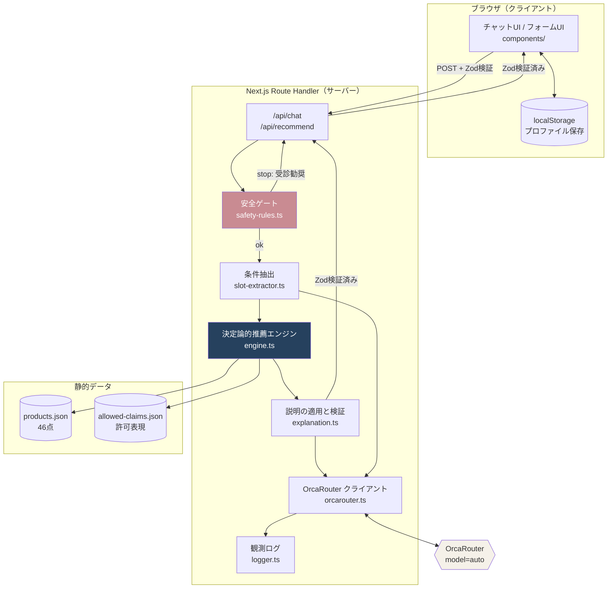
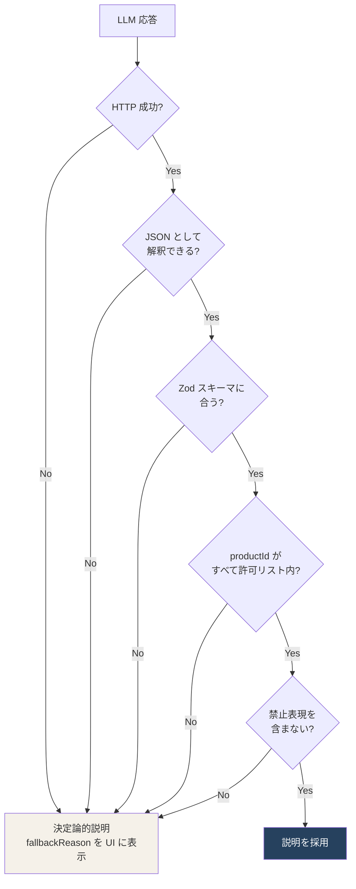
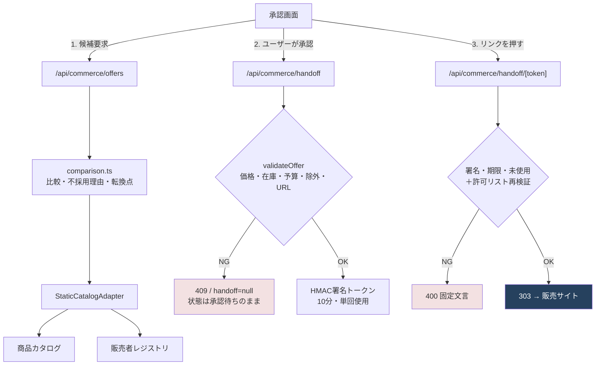

# CHIGIRI Beauty アーキテクチャ

## 全体像



## 推薦パイプライン（LLM の境界）

```mermaid
flowchart LR
    A["1. 入力検証<br/>Zod"] --> B["2. ハードフィルタ<br/>アレルギー・使用感"]
    B --> C["3. 役割分類<br/>カテゴリー"]
    C --> D["4. 決定論的<br/>スコアリング"]
    D --> E["5. 重複検出"]
    E --> F["6. ルーティン生成<br/>使用順・時間調整"]
    F --> G["7. 不足検出"]
    G --> H["8. 買い足し1点<br/>の決定"]
    H --> I["9. 許可IDのみ<br/>LLMへ送信"]
    I --> J["10. 説明文生成"]
    J --> K["11. スキーマ検証<br/>ID照合・表現検査"]
    K -->|"合格"| L["説明を重ねて返す"]
    K -->|"不合格"| M["決定論的説明で返す"]

    style A fill:#26415E,color:#fff
    style B fill:#26415E,color:#fff
    style C fill:#26415E,color:#fff
    style D fill:#26415E,color:#fff
    style E fill:#26415E,color:#fff
    style F fill:#26415E,color:#fff
    style G fill:#26415E,color:#fff
    style H fill:#26415E,color:#fff
    style J fill:#F3E1E2
    style M fill:#F5F1E9
```



濃い藍色の工程は **LLM を一切使いません**。
LLM が関与するのは工程 10 のみで、工程 11 の検証を通らなければその出力は破棄されます。

## AI 出力の検証段階



失敗は隠さず、`ai.fallback` と `ai.fallbackReason` を結果画面の根拠パネルに表示します。

## 責務の分離

| レイヤー | 置いてよいもの | 置いてはいけないもの |
|---|---|---|
| `components/` | 表示・入力 | 推薦ロジック、スコア計算、API キー |
| `app/api/` | 入出力の検証、オーケストレーション | スコア計算、商品選定 |
| `domain/` | 純粋な判断ロジック | LLM 呼び出し、`process.env`、DOM |
| `server/` | LLM 呼び出し、プロンプト | 商品選定、スコア変更 |
| `schemas/` | 型と検証 | ロジック |

`domain/` は Node 環境でそのまま単体テストできます（177 ケースの大半がここと `server/` を対象にしています）。

## データフロー上の個人情報

| データ | 保存先 | サーバー保存 |
|---|---|---|
| 肌傾向・関心・予算・時間 | ブラウザの localStorage | しない |
| 手持ち商品 ID | ブラウザの localStorage | しない |
| チャット本文 | メモリ上のみ | しない（ログにも残さない） |
| LLM の観測メトリクス | 標準出力 | 本文を含まない形でのみ |
| 買った／見送った／続いたの記録 | ブラウザの localStorage（同意後のみ） | しない |
| コマース監査ログ | 標準出力＋直近200件 | 商品・販売者・価格・阻止理由のみ |

MVP では DB を使いません。

## エージェンティックコマース層



外部 URL がクライアントへ渡るのは、③ の 303 レスポンスの `Location` だけです。
① ② の応答に含まれるのは内部パスのみで、クエリ文字列から遷移先を受け取る経路はありません。

### 承認ゲートを型で強制する

```ts
transition(from, to, { userInitiated })  // userInitiated 省略時は false
```

`PURCHASE_HANDOFF_READY` は `USER_GATED` に含まれるため、
`userInitiated: true` を明示的に渡さない限り `user_action_required` で失敗します。
`AgentTrace.advance()` は失敗時に状態も記録も変えずに `false` を返すので、
呼び出し側が戻り値を無視して先へ進むと、状態が承認待ちのまま残り、
「承認済みとして扱われた」状態を作れません。
